### Set Up Envorinment
####Install Go version `1.14`

1. Follow the instructions on https://golang.org/doc/install#download to download and install Go
2. You can visit https://golang.org/dl/ to find and download the version `1.14`

   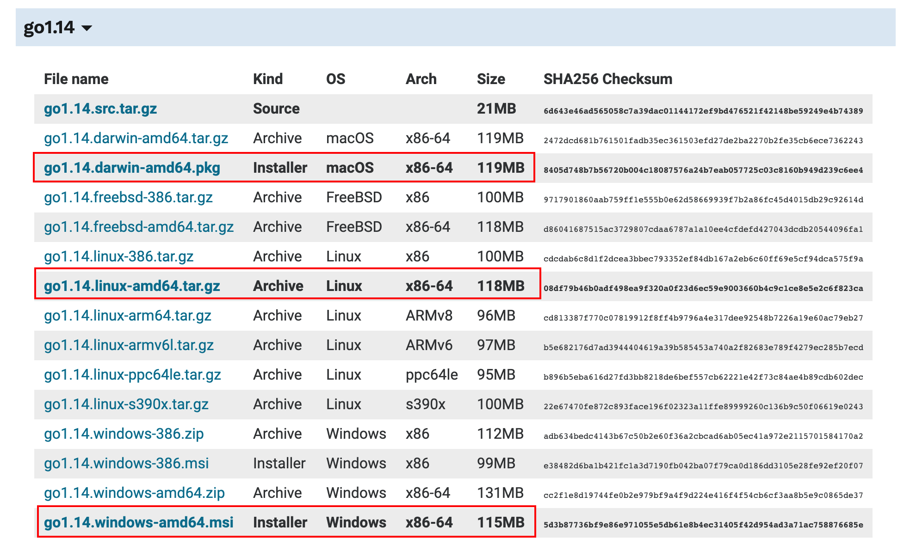

3. Verify your installation is successful by checking the go version on your machine

   - In cmd/terminal on your machine, enter:

     `$ go version`

   - You should see the following result in cmd/terminal:

     `go version go1.14 darwin/amd64`

#### Install MongoDB

1. Follow the instructions on https://docs.mongodb.com/manual/installation/ to download and install MongoDB.

2. Verify your installation is successful by checking the MongoDB server and MongoDB Shell version on your machine.

   1. Check MongoDB Server Version

      - In cmd/terminal, enter:

        `$ mongod -version`

      - You should see the following results:

        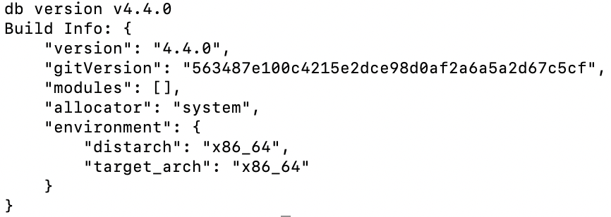

   2. Check MongoDB Shell Version

      - In cmd/terminal, enter:

        `$ mongo -version`

      - You should see the following results:

        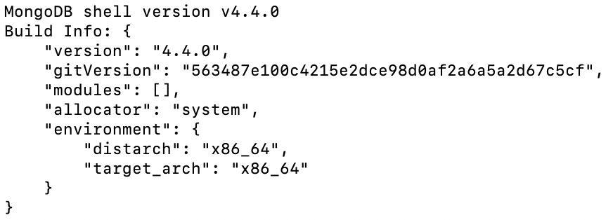

#### Install Node.js

1. Follow the instructions on https://nodejs.org/en/download/ to download and install node.js.

2. Verify your installation is successful by checking the node version on your machine.

   - In cmd/terminal, enter:

     `$ node -v`

   - You should see something looks like the following result

     `v14.16.0`

---

### Build

0. Please use Go version `1.14` for building. (Tested on `1.14.15`). Make sure Go is installed properly on your machine.

1. In cmd go to folder `Checkinandout`. (cmd may vary in different system, current one is based on Mac)

   `$ cd {your path}/Chechinandout`

2. In cmd run `$ go build`.

3. If build successfully, you’ll see an executable file named `cc-server.exe` (or `cc-server`) under the project root.

   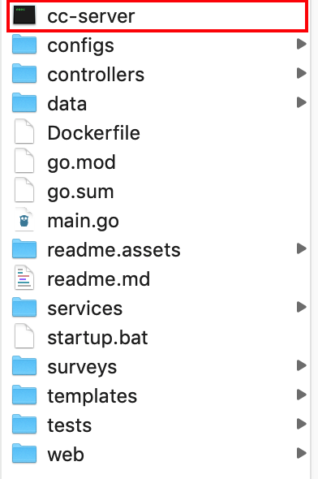

### Run The Backend
0. Create an empty `data` folder under project root. <strong>Make sure all the cmd run is under the project root.</strong>

   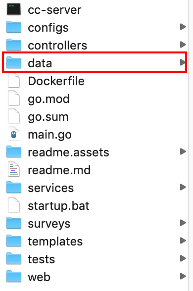

1. Open file CHECKINANDOUT/configs/cc-server.json, change the `mongo_server_uri` and `server_address` to your local address. You can refer to the `cc-server-dev.json` file.

   - Find the configuration files for backend

   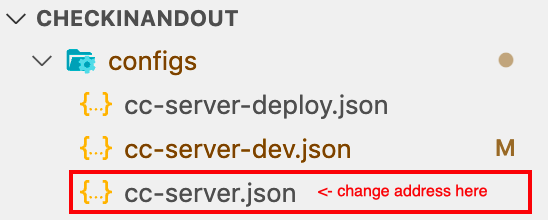

   - Change addresses

   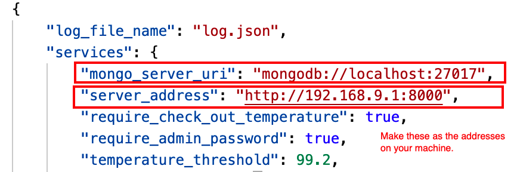

2. click `startup.bat` and let it run (if you are using Mac, please use the alternative methods).

3. A portal website will be hosted at `localhost:8000\super-admin\redirect`. Please open the url in browser to use it.
##### Alternatively
1. Please startup a mongodb server. For local mongo server, in cmd run `mongod --dbpath=/data` (you can replace the "/data" with any directory you wish; you need to create the folder before running `mongod`). If cmd reports "mongod not recognized", please install mongodb or check environment variables.

   - If running successfully, you’ll see something looks like the following results

     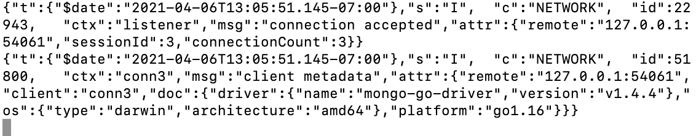

2. In cmd, run `.\cc-server.exe`. (On Mac, run `./cc-server`)

   -  If you get the following result, then the backend is running well

     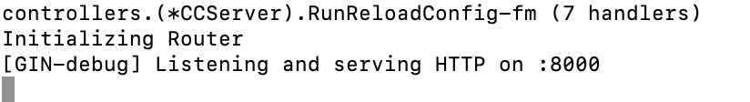

3. A portal website will be hosted at `localhost:8000\super-admin\redirect`. Please open the url in browser to use it.

### Run the Frontend
0. Make sure the backend is running properly on your machine and <strong>you are under the project root.</strong>

1. Go to `web/cc-portal/config/index.js`, use the localhost address as the API address.

   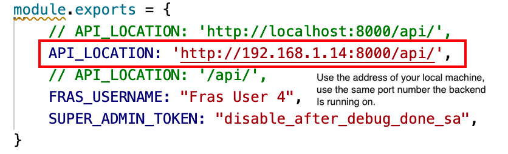

2. In terminal, go to the folder `web/cc-portal`

   `$ cd web/cc-portal`

3. In terminal, run `$ npm install`.

   - Run `npm -v` to check npm is installed properly.
   - You’ll get npm version information as the result.

4. Use `$ npm run serve` to run the frontend app. The app will be hosted at `http://localhost:8080/`. 

   - If success, you’ll get results like the following:

     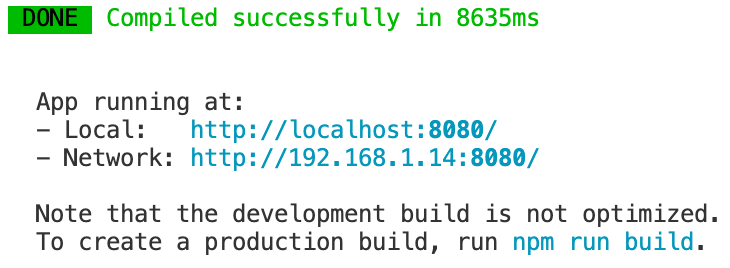

   - ​	Open `http://localhost:8080/mobile/activate`, for example, to see the frontend app.

5. Use `$ npm run build` to build the frontend app, the buit files will be in `web/cc-portal/dist`.

### Update Twilio SMS Token:
1. Login to `mongo` shell, and switch db by `use go_mongo`
2. Update the Token using the following shell command:
`> db.configs.update({name: "default"}, {$set: {sms_auth_token: "65a64755b83eb1e8e6ece4a7e7b6bce7"}})` 
If Succeed, the shell returns info: `WriteResult({ "nMatched" : 1, "nUpserted" : 0, "nModified" : 1 })`

### Testing the Code
0. **Testing is recommended** after changing/refractoring the code.
1. To run tests, run following command in cmd: `go clean -testcache; go test ./tests`
2. (Optional) to show debug info when testing, append `-v` option to `go test` (`go test ./tests -v`) 